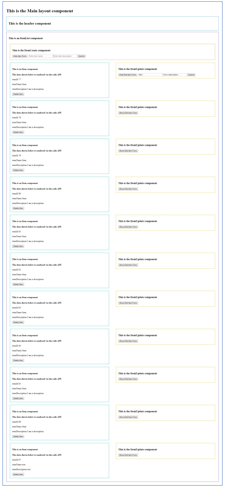

# React Rails CRUD demo app
Application with basic CRUD functionality using Rails 5 as a backend & React 16 on the frontend.  
 (WIP)

## Installation
- Clone repo
- Install requried gem bundles `bundle install`
- Migrate & seed the db:  `rake db:migrate && rake db:seed`
- Start the server on port 3001*: `rails s -p 3001`

\* _Make sure to use port 3001 to avoid CORS issues due to absolute urls in fetch requests_

## Todos:
- [x] Start todo list
- [x] Setup rails api with dummy data
- [x] Setup rails CRUD
- [x] Add react layout components
- [x] Setup initial data fetch in react components
- [x] Add crud view create
- [ ] Add crud view update
- [x] Add crud delete 
- [ ] Add lazy loading for items list
- [ ] Add style fixes & sass support
- [ ] Make a sandwich  
 
## Brought to you by:
- Rails 5.2.2
- React 16.x
- React Rails
- Webpacker